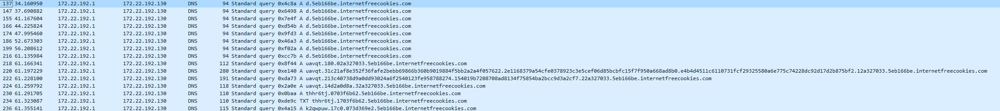
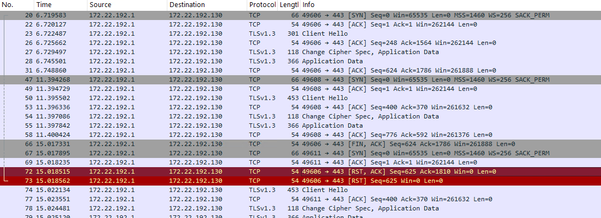

# DNS C2 Development Environment Setup

## Overview

Setting up DNS beacons in a Windows 10 development environment with Cobalt Strike Team Server running on Windows Subsystem for Linux (WSL) presents unique networking challenges. Windows  cannot port forward UDP traffic on port 53 to the WSL-hosted Team Server, requiring specific configuration steps to establish proper communication.

> [!IMPORTANT]
>This configuration only supports beacons running on the local Windows Development Machine. External beacons cannot access the Team Server IP address within the WSL environment.

## Standard DNS Beacon Configuration

### Step 1: Configure WSL Environment

First, stop the ```systemd-resolved``` service on WSL to free port ```53``` for the Team Server:

```bash
sudo systemctl stop systemd-resolved
```

> [!NOTE]
>The systemd-resolved service will automatically restart after a system reboot. You may need to repeat this step after restarting the WSL environment.

### Step 2: Create DNS Listener in Cobalt Strike

- Configure a DNS listener in the Cobalt Strike client with the following settings:

    - Payload: ```Beacon DNS```
    - DNS Hosts: ```internetfreecookies.com```
    - DNS Host (Stager): ```internetfreecookies.com```
    - DNS Port (Bind): ```53```
    - DNS Resolver: ```Team Server IP from the WSL Linux server [see “ifconfig” output]```. This causes the DNS Beacons on Windows 10 to talk directly to the Team Server IP with port 53.

### Step 3: Run the DNS Beacon

- Generate a Payload
- Run the DNS payload on your Windows Development Machine, and you should get a new beacon on the Cobalt Strike console.

### Step 4: Validate the results in Wireshark:

Open Wireshark on the Windows Development Machine: 

- Interface: vEthernet (WSL)
- Filter: ```ip.dst==<Team Server IP from the WSL Linux server> and udp.port==443```

    
 

## DNS-over-HTTPS (DoH) Beacon Configuration

### Step 1: AdGuard DNS Proxy on WSL Installation

1. Download the latest AdGuard Home DNS proxy (standalone version)

    ```bash
    mkdir -p ~/tools && cd ~/tools
    curl -s https://api.github.com/repos/AdguardTeam/dnsproxy/releases/latest \
    | grep browser_download_url \
    | grep linux-amd64 \
    | cut -d '"' -f 4 \
    | wget -i -
    ```

2. Extract it

    ```bash
    tar -xvzf dnsproxy-linux-amd64-*.tar.gz
    cd linux-amd64
    chmod +x dnsproxy
    sudo mv dnsproxy /usr/local/bin/
    ```

3. Verify Installation

    ```bash
    dnsproxy --version
    ```

4. Create a self-signed certificate/key

    ```bash
    openssl req -newkey rsa:2048 -nodes -keyout cs-adguard.key -x509 -days 365 -out cs-adguard.crt
    ```

5. Start a AdGuard DNS Proxy

    ```bash
    dnsproxy \
    --listen-address <Team Server IP from the WSL Linux server> \
    --https-port=443 \
    --tls-crt=cs-adguard.crt \
    --tls-key=cs-adguard.key \
    --port 0 \
    --upstream <Team Server IP from the WSL Linux server>:53 \
    --verbose
    ```

### Step 2: Create a Listener for DoH:

1. Modify the Malleable C2 profile ```dns-beacon``` section:

    ```perl
    dns-beacon "dns-over-https-dev" {
        set comm_mode "dns-over-https"; # [dns | dns-over-https]
        dns-over-https {
            set doh_verb "GET"; # [POST | GET]
            set doh_server "<Team Server IP from the WSL Linux server>";
        }
    }
    ```
2. Restart the Team server loading the modified profile

    ```bash
    ./teamserver <ip> <password> ./doh.profile
    ```

3. Configure a DNS over HTTP listener in the Cobalt Strike client with the following settings:

    - Payload: ```Beacon DNS```
    - DNS Hosts: ```internetfreecookies.com```
    - DNS Host (Stager): ```internetfreecookies.com```
    - Profile: ```dns-over-https-dev```
    - DNS Port (Bind): ```53```
    - DNS Resolver: ```Should be left empty```

### Step 3: Run the DNS over HTTP Beacon

- Generate a Payload that uses the previously generated listener. The ```DNS Comm Mode``` setting should default to ```dns-over-https```
- Run the DNS-over-HTTPS payload on your Windows Development Machine, and you should get a new beacon on the Cobalt Strike console.


### Step 4: Validate the results in Wireshark:

Open Wireshark on the Windows Development Machine: 

- Interface: vEthernet (WSL)
- Filter: ```ip.dst==<Team Server IP from the WSL Linux server> and tcp.port==443```

    